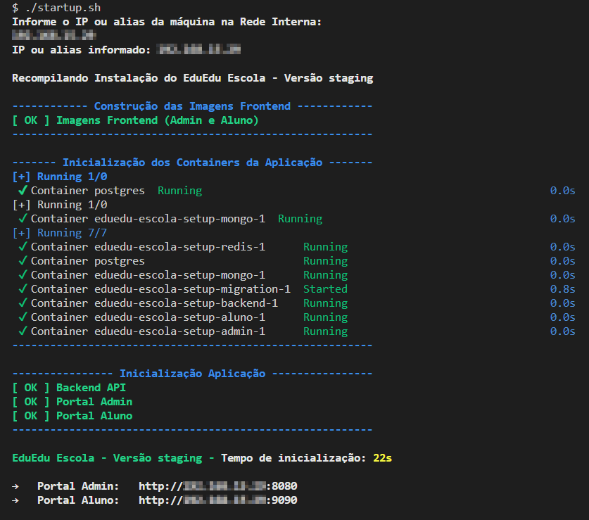

# Guia para Iniciantes: Pré-requisitos e Instalação

## Antes de começar

Antes de instalar qualquer coisa, certifique-se de ter os seguintes itens prontos:

### Se você está usando o Windows:

#### GIT
- Faça o download do GIT para Windows [aqui](https://git-scm.com/download/win).

#### Docker
1. Siga as instruções para instalar o WSL [aqui](https://learn.microsoft.com/pt-br/windows/wsl/install).
2. Instale o Docker no Windows seguindo [estas instruções](https://docs.docker.com/desktop/install/windows-install/).

#### CURL
- Baixe o CURL [aqui](https://curl.se/download.html).

### Se você está usando o Linux:

#### Superusuário:
Para uma instalação mais fácil, você precisa saber a senha do seu usuário e ter certeza de que tem os seguintes itens:
1. Docker
2. Wget
3. CURL

**Permissões:**
Você precisará de privilégios de administrador para instalar.

## Importante!

Para que tudo funcione corretamente, você precisará de uma credencial SMTP válida para o sistema de e-mail. Isso é essencial para que os usuários recebam a confirmação da conta por e-mail.

---

## Como Instalar

### Se você está usando o Windows:

1. **Encontrando seu Endereço IP:**
   - Clique em "Iniciar" e vá para "Configurações".
   - Selecione "Rede e Internet".
   - Encontre o endereço IP clicando em "Ethernet" para conexões com fio ou "Wi-Fi" para conexões sem fio. O endereço IPv4 será visível.

2. **Acessando o Diretório Principal:**
   - Abra o terminal GIT BASH.

3. **Executando o Script de Instalação:**
   ```bash
   ./startup.sh
   ```

4. **Durante a Instalação:**
   - O script solicitará seu endereço IP.
   - Informe o endereço IPv4 obtido na etapa 1.

### Se você está usando o Linux:

1. **Abrindo o Terminal:**
   - Execute o seguinte comando:
     ```bash
     sudo ./startup-linux.sh
     ```

---

**Conclusão da Instalação**

Após o término do script, você verá um resultado semelhante à imagem abaixo:



**Portal do Administrador:**
- Acesse em: http://<IP da máquina informado>:8080

**Portal do Aluno:**
- Acesse em: http://<IP da máquina informado>:9090

---

# Dicas Finais

**Liberação de Portas**

Para acessar os Portais do Administrador e do Aluno na rede interna, certifique-se de liberar as seguintes portas:
- 8080 (Portal do Administrador)
- 9090 (Portal do Aluno)
- 3000 (API)

Para mais detalhes sobre como liberar portas, consulte os links abaixo:

- **Windows**: [Criar uma regra de porta de entrada](https://learn.microsoft.com/pt-br/windows/security/operating-system-security/network-security/windows-firewall/create-an-inbound-port-rule)
